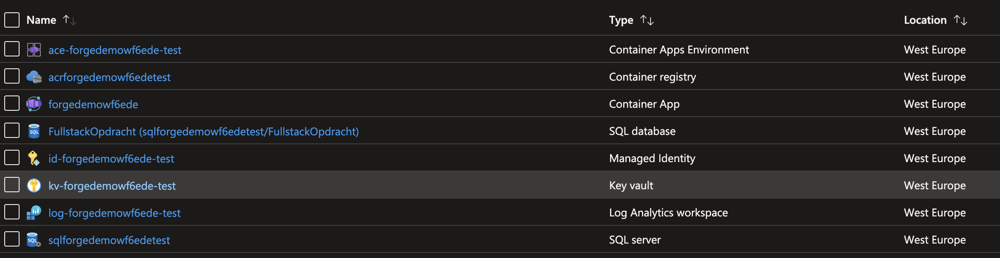

# Beste Solicitant

 In onze Azure omgeving hebben we een account aangemaakt voor jou, en een resource group gecreëerd met en verschillende resources, in de infrastucture map vind jij de code die gebruikt is om jouw omgeving te configureren.




In de src map zitten een angular aspnet core project, deze heeft naast de default het volgende:

De applicatie is geconfigureerd om op basis van credentials secrets uit Azure KeyVault te lezen.
```cs
var credential = new DefaultAzureCredential(new DefaultAzureCredentialOptions
{
    ExcludeVisualStudioCredential = true
});
builder.Configuration.AddAzureKeyVault(
    new Uri($"https://{builder.Configuration["KeyVaultName"]}.vault.azure.net/"), credential);

```

Met de credentials kan jij ook een SqlConnection open hieronder een voorbeeld van hoe dat zou kunnen.
```cs
app.MapGet("api/sql", async () =>
{
    using var conn =
    new SqlConnection("Server=tcp:sqlforgedemowf6edetest.database.windows.net,1433;Initial Catalog=FullstackOpdracht;");
    var token = await credential.GetTokenAsync(
        new TokenRequestContext(new[] { "https://database.windows.net/.default" }));
    conn.AccessToken = token.Token;
    await conn.OpenAsync();
    return "Sql Server Ready";
});
```

We hebben ook alvast in de KeyVault secrets toegevoegd om een token te kunnen verkrijgen van Forge api.
```cs
app.MapGet("api/forge", async (IConfiguration configuration) =>
{
    var client = new HttpClient
    {
        BaseAddress = new Uri("https://developer.api.autodesk.com/")
    };
    var keyvalue = new List<KeyValuePair<string, string>>
        {
            new("client_id", configuration["ForgeClientId"]),
            new("client_secret", configuration["ForgeClientSecret"]),
            new("grant_type", "client_credentials"),
            new("scope",
                "user-profile:read viewables:read data:read data:write data:create data:search bucket:create bucket:read bucket:update bucket:delete code:all account:read account:write")
        };
    var response = await client.PostAsync("/authentication/v1/authenticate", new FormUrlEncodedContent(keyvalue));
    response.EnsureSuccessStatusCode();
    var responseObject = JsonConvert.DeserializeObject<Authorization>(await response.Content.ReadAsStringAsync());
    return responseObject!.AccessToken;
});
```

## Applicatie deployen

Voordat je de applicatie kan deployen moet je ingelogd zijn bij azure. Jij kunt hiervoor de credentials gebruiken die we voor jouw hebben aangemaakt.

```ps
az login
```

De applicatie kan gebouwd en gedeployed worden met de volgende commands:

```ps
$tag = "<tag>"
cd src
az acr build -r acrforgedemowf6edetest -t forgedemo:$tag .
az deployment group create -g rg-fullstackopdracht -f ../.infrastructure/main.bicep --parameters ../.infrastructure/parameters.json --parameters tag=$tag
```

## De Opdracht

1. Gebruik de [forge documentatie](https://learnforge.autodesk.io/#/) om de huidige applicatie uit te breiden en het mogelijk te maken om een ifc file in te lezen.  

2. Gebruik de [forge documentatie](https://learnforge.autodesk.io/#/) om de ifc te kunnen viewen.

3. Maakt script om het deployen van deze applicatie eenvoudiger te maken.
